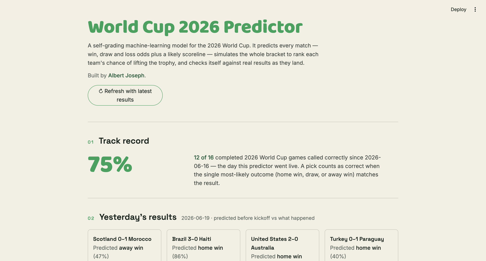
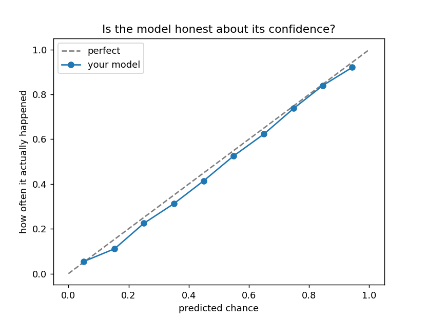

# ⚽ World Cup 2026 Predictor

A self-grading machine-learning model for the 2026 FIFA World Cup. It predicts
every match (win / draw / loss odds plus a likely scoreline), simulates the whole
tournament to rank each team's chance of lifting the trophy, and checks its own
predictions against real results as they land.

**Live demo:** _add your Streamlit Community Cloud link here after deploying_



Built by **Albert Joseph**.

---

## What it does

- **Track record** — cumulative prediction accuracy since the day it went live, graded against real results.
- **Yesterday's results** — what the model predicted before kickoff vs. what actually happened, with ✓ / ✗.
- **Today's games** — for each fixture: win/draw/loss bars, a Dixon-Coles scoreline + expected goals, an auto-generated LLM match preview, a "confident pick" / "toss-up" tag, and a breakdown of the inputs.
- **Road to the Cup** — a Monte Carlo simulation of the remaining tournament that ranks each team's title odds.

## How it works

| Component | Approach |
|---|---|
| **Match outcome** | XGBoost 3-way classifier (home win / draw / away win) |
| **Features** | Margin-of-victory Elo, recent scoring form, squad strength, host-nation flag, crowd-support proxy |
| **Scorelines** | Dixon-Coles bivariate-Poisson goals model (scipy MLE, recency-weighted) |
| **Title odds** | Monte Carlo simulator — official 2026 groups, Annex-C knockout bracket, real tiebreakers, penalties as a near coin-flip |
| **Match previews** | Anthropic Claude, generated once per fixture and cached to disk (billed once) |

All features are computed in one place (`build_features` in `model.py`) and use only
information available **before** kickoff, so predictions are leakage-safe and the
track record is honest.

## Results

Measured on a time-based holdout (most recent 15% of ~49,000 international matches —
the model never trains on games it's tested on):

| Metric | Value |
|---|---|
| Accuracy (3-way) | **61.0%** |
| Baseline — always pick the most likely class | 48.0% |
| Log loss | **0.859** |
| Elo-only baseline log loss | 0.871 |
| Calibration error (ECE) | **0.011** |
| Accuracy on "confident" picks (top outcome ≥ 60%) | ~76% |

The low calibration error is the headline: when the model says 70%, it happens
about 70% of the time. Adding margin-of-victory weighting to the Elo was a small,
honest gain (log loss 0.862 → 0.859, accuracy 60.6% → 61.0%) without hurting
calibration. The analysis behind these choices lives in `experiment.py`,
`experiment_elo.py`, and `confidence_thresholds.py`.

### Is the model honest about its confidence?



The closer the line hugs the diagonal, the more trustworthy the probabilities.

## Limitations

This is a portfolio project with deliberate, documented simplifications:

- **Squad strength is a single 2021 snapshot** (aggregated FIFA player ratings), not time-varying — it doesn't know about recent transfers, injuries, or form changes.
- **The atmosphere/crowd-support factor is a proxy**, not real data. It's based on travel proximity (distance from each team's country to the venue) with a host boost — *not* actual ticket sales or attendance.
- **Football is genuinely hard to predict.** Roughly 40% of matches are upsets or draws; ~61% accuracy against a 48% baseline is near the practical ceiling for 1X2 prediction. The model is calibrated, not clairvoyant.
- **Title odds are not real-time.** They reflect results already in the dataset and update when you refresh.

## Running locally

```bash
pip install -r requirements.txt

# optional — enables AI match previews (otherwise a friendly note is shown)
export ANTHROPIC_API_KEY=sk-ant-...

streamlit run app.py
```

To refresh predictions/ratings after new results post, re-run `python3 model.py`
(retrains and saves the model), then relaunch.

## Project layout

| File | Purpose |
|---|---|
| `app.py` | Streamlit UI |
| `model.py` | Feature engineering + XGBoost training (`predictor_model.joblib`) |
| `dixon_coles.py` | Dixon-Coles goals model (`dc_model.joblib`) |
| `sim.py` | Monte Carlo tournament simulator |
| `daily.py` | Today's/yesterday's games + the self-grading accuracy ledger |
| `preview.py` | Cached LLM match previews |
| `prewarm_previews.py` | Pre-generate a day's previews in one batch |
| `wc_data.py` | 2026 groups, venues, country coordinates |
| `build_squad_strength.py` | Builds `data/squad_strength.csv` from FIFA ratings |
| `experiment*.py`, `confidence_thresholds.py` | Model analysis (calibration, Elo comparison, thresholds) |

## Data & credits

- Match results: [martj42/international_results](https://github.com/martj42/international_results)
- Squad strength: FIFA 22 player ratings (a 2021 snapshot)
- Match previews: [Anthropic Claude](https://www.anthropic.com)

Built by **Albert Joseph**.
